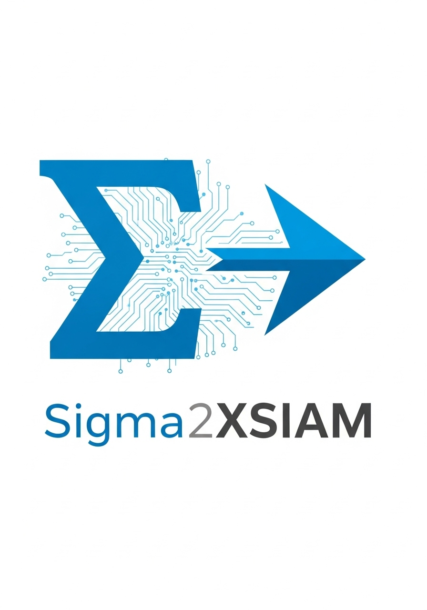

#  Sigma2XSIAM

This repository contains a custom **pySigma backend** specifically designed to convert Sigma rules into functional and accurate **Cortex XSIAM XQL queries**.

The standard `pysigma-backend-cortexxdr` often falls short in handling the specific syntax and data models required by Cortex XSIAM. This project provides a robust backend and a detailed processing pipeline to bridge that gap, enabling security teams to leverage the vast library of open-source Sigma rules directly within their XSIAM environment.

## Key Features

* **Accurate XQL Syntax:** Correctly handles XSIAM's specific syntax for operators like `contains`, `startswith`, and `endswith`.
* **Cortex XDM Alignment:** Includes a comprehensive processing pipeline (`cortex_xdm.yml`) that maps generic Sigma fields to the official Cortex Extended Data Model (XDM) schema.
* **Advanced Modifier Support:** Properly converts complex Sigma modifiers, such as `contains|all`, into the correct `AND`-based logic required by XQL.
* **PowerShell Rule Conversion:** Translates PowerShell `ScriptBlockText` into searches against the correct XSIAM field (`xdm.source.process.command_line`).
* **Clean and Readable Output:** Automatically formats the final query to be clean, readable, and ready to be used in the XSIAM console.

## Installation

1.  **Clone the Repository:**
    ```bash
    git clone https://github.com/deepzec/Sigma2XSIAM.git
    cd Sigma2XSIAM
    ```

2.  **Create and activate a virtual environment (Recommended):**
    ```bash
    python3 -m venv venv
    source venv/bin/activate
    ```

3.  **Install Dependencies:**
    Install the required packages using the `requirements.txt` file.
    ```bash
    pip install -r requirements.txt
    ```

4.  **Install the Backend:**
    Install the project in "editable" mode. This allows you to make changes to the code or pipeline and have them take effect immediately.
    ```bash
    pip install -e .
    ```

## How to Use

Use a simple Python script to load your custom pipeline, the backend, and a Sigma rule to perform the conversion.

1.  **Create a Sigma Rule (`rule.yml`):**
    ```yaml
    title: ADRecon Execution
    id: 16863619-3898-46d8-a159-224483584988
    status: test
    description: Detects the execution of ADRecon.ps1 script.
    logsource:
        product: windows
        category: powershell_script
    detection:
        selection:
            ScriptBlockText|contains|all:
                - 'Function Get-ADRExcelComOb'
                - 'Get-ADRGPO'
                - 'Get-ADRDomainController'
    condition: selection
    level: high
    ```

2.  **Create a Conversion Script (`convert_rule.py`):**
    ```python
    from sigma.rule import SigmaRule
    from sigma.processing.pipeline import ProcessingPipeline
    from sigma.backends.cortexxsiam import CortexXSIAMBackend

    print("--- Starting Sigma to XSIAM Conversion ---")

    try:
        # Load the custom processing pipeline
        print("Loading YAML pipeline...")
        with open("pipelines/cortex_xdm.yml", "r") as f:
            pipeline = ProcessingPipeline.from_yaml(f.read())
        print("Pipeline loaded.")

        # Initialize the backend with the pipeline
        siem_backend = CortexXSIAMBackend(processing_pipeline=pipeline)
        print("Backend initialized.")

        # Load the Sigma rule
        print("Loading Sigma rule...")
        with open("rule.yml", "r") as f:
            sigma_rule = SigmaRule.from_yaml(f.read())

        # Convert the rule
        print("Converting rule...")
        xql_query = siem_backend.convert_rule(sigma_rule)[0]

        print("\n✅--- CONVERSION SUCCESSFUL ---✅")
        print("Generated XSIAM Query:")
        print(xql_query)

    except Exception as e:
        print(f"\n❌--- CONVERSION FAILED ---❌")
        print(f"An error occurred: {e}")
    ```

3.  **Run the script:**
    ```bash
    # Basic usage - convert rule.yml (displays query in console)
    python convert_rule.py
    
    # Convert single rule and save to output file
    python convert_rule.py -r rule.yml -o output.xql
    
    # Batch convert all rules in a directory
    python convert_rule.py -d /path/to/sigma/rules
    
    # Batch convert and save all queries to output directory
    python convert_rule.py -d /path/to/sigma/rules -o output_queries/
    
    # View all available options
    python convert_rule.py --help
    ```

### Command-Line Options

- `-r RULE, --rule RULE` - Input Sigma rule file (single file mode)
- `-d DIRECTORY, --directory DIRECTORY` - Directory containing Sigma rules for batch conversion
- `-o OUTPUT, --output OUTPUT` - Output file path (single rule) or directory (batch mode)
- `-h, --help` - Show help message and exit

### Batch Processing

When using `-d` to process a directory:
- Recursively finds all `.yml` and `.yaml` files
- Converts each rule to XQL format
- Shows conversion summary with success/failure statistics
- Optionally saves all queries to an output directory with `-o`
- Preserves directory structure in output folder

### Example Output

**Single Rule Conversion:**
```
--- Starting Sigma to XSIAM Conversion ---
Loading YAML pipeline...
Pipeline loaded.
Backend initialized.
Loading Sigma rule...
Converting rule...

✅--- CONVERSION SUCCESSFUL ---✅
Generated XSIAM Query:
datamodel dataset = * | filter (xdm.source.process.command_line contains "Function Get-ADRExcelComOb" and xdm.source.process.command_line contains "Get-ADRGPO" and xdm.source.process.command_line contains "Get-ADRDomainController")

✅ Query saved to: output.xql
```

**Batch Directory Conversion:**
```
--- Starting Sigma to XSIAM Conversion ---
Loading YAML pipeline...
Pipeline loaded successfully.
Initializing backend...
Backend initialized successfully.

Found 250 rule file(s) in /sigma/rules

Converting: windows/process_creation/suspicious_command.yml... ✅ SUCCESS
Converting: windows/network/suspicious_connection.yml... ✅ SUCCESS
Converting: linux/auditd/privilege_escalation.yml... ✅ SUCCESS
...

============================================================
CONVERSION SUMMARY
============================================================
Total rules processed: 250
✅ Successful: 243 (97.20%)
❌ Failed: 7 (2.80%)

📁 Output directory: output_queries/
```

## Important Note

**Dataset Configuration:** The default converter returns `dataset = *` in the generated XQL queries. For optimal query response performance, please modify this to your actual dataset name (e.g., `dataset = xdr_data`, `dataset = endpoint_data`, etc.) based on your specific XSIAM environment and data sources.

## Testing & Conversion Rates

The Sigma2XSIAM converter has been extensively tested with real-world Sigma rules from the official SigmaHQ repository to ensure robust conversion capabilities.

### Conversion Summary
- Success Rate: 97.36% (3,064/3,147 rules converted successfully)
- Test Dataset: 3,147 real Sigma detection rules from SigmaHQ/sigma
- **Rule Coverage:** 
  - ✅ Windows endpoint rules (process creation, PowerShell, registry, file operations)
  - ✅ Cloud platform rules (AWS CloudTrail, Azure, GCP, Okta)
  - ✅ Web application security rules (SQL injection, XSS detection)
  - ✅ Network monitoring rules (Zeek, DNS, firewall, proxy)

The converter successfully handles complex Sigma rules including multiple selection criteria, logical operators (OR/AND/NOT), field-to-field comparisons, and advanced string patterns, making it production-ready for security teams migrating their detection rules to Cortex XSIAM.

## Project Structure

* `sigma/backends/cortexxsiam.py`: The core Python code for the backend translator.
* `pipelines/cortex_xdm.yml`: The YAML processing pipeline that handles all field mappings. **This is the main file to edit to add or change field translations.**
* `pyproject.toml`: The project definition file.
* `requirements.txt`: A list of all Python dependencies.

## Bug Reports & Issues

If you encounter any issues, conversion errors, or have suggestions for improvements, please report them by:

1. **Creating an Issue**: Open a new issue in this repository with detailed information about the problem
2. **Include Details**: Please provide:
   - The Sigma rule that failed to convert (if applicable)
   - Error messages or unexpected output
   - Your environment details (Python version, pySigma version)
   - Expected vs. actual behavior

Your feedback helps improve the converter for the entire security community!
